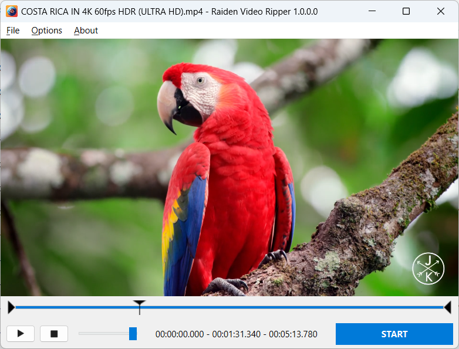

# RaidenVideoRipper
 

Application for rippin parts of video and converting them to mp4 and/or gif (PyQT6)
FFMPEG_BINARY environment variable required!
Download ffmpeg (for Windows), extract it to some directory, set environment veriable FFMPEG_BINARY to absolute ffmpeg(.exe) path.
