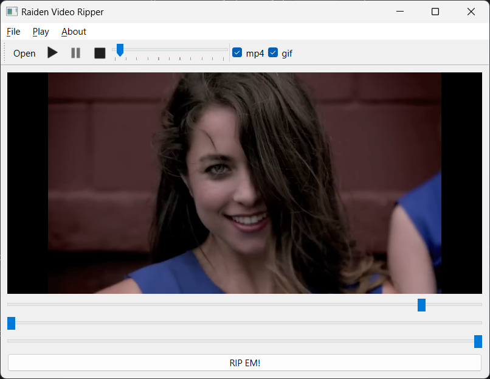

# Raiden Video Ripper

**Raiden Video Ripper** - это проект с открытым исходным кодом, предназначенный для редактирования видео и конвертации форматов. Он создан с использованием Qt 6 (Qt Creator) и позволяет обрезать и конвертировать видео в форматы MP4, GIF и WebM. Вы также можете извлекать аудио из видео и конвертировать его в формат MP3.

## Установка
Откройте файл `RaidenViewRipper.pro` и соберите проект в Qt 6 - Qt Creator. Обратите внимание, что для использования этого инструмента вам необходимо правильно настроить переменную среды FFMPEG_BINARY.

Шаги:

1. Скачайте FFmpeg для Windows.
1. Распакуйте его в каталог по вашему выбору.
1. Установите переменную среды FFMPEG_BINARY на абсолютный путь к исполняемому файлу FFmpeg (FFmpeg.exe).

Raiden Video Ripper упрощает редактирование и конвертацию видео, делая его доступным инструментом для любителей открытого исходного кода.

Возможно, что приложение может работать как на Linux, так и на MacOS, но оно никогда не было протестировано на этих операционных системах.

### Ссылки
- Qt 6: https://www.qt.io/product/qt6
- FFmpeg для Windows: https://ffmpeg.org/download.html#build-windows

### Стиль кодирования
- https://wiki.qt.io/Qt_Coding_Style

### Версионирование
- https://semver.org
